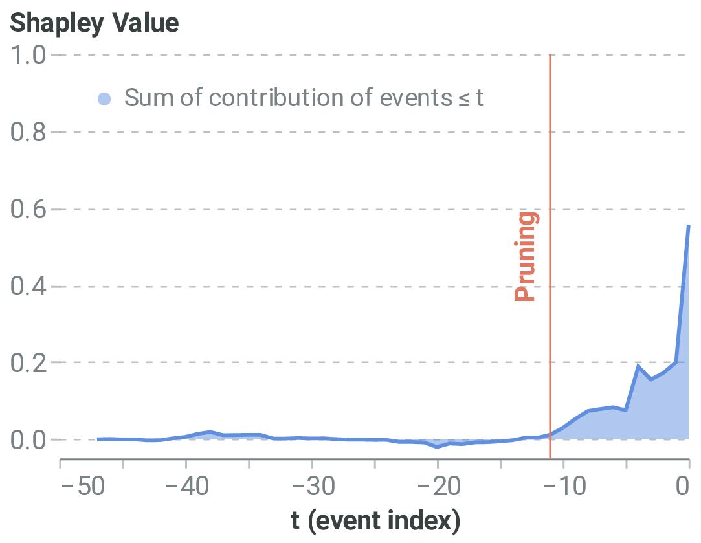
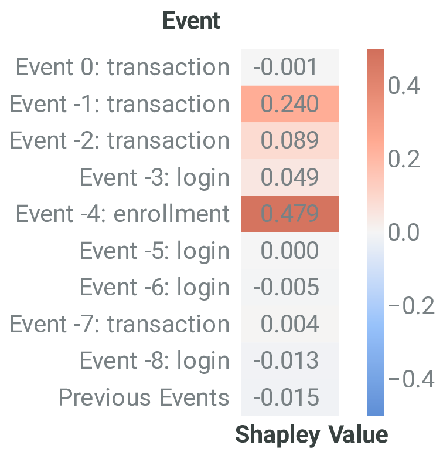
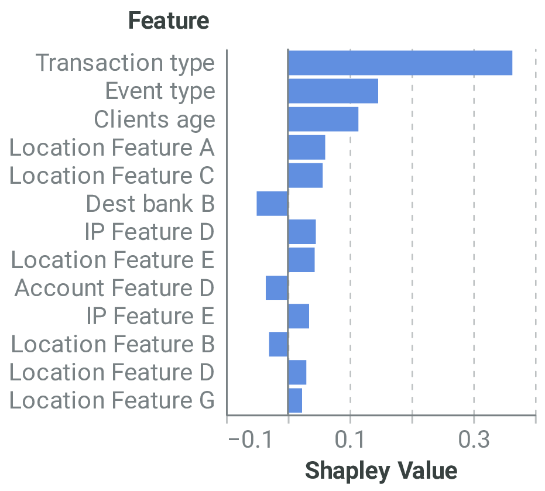
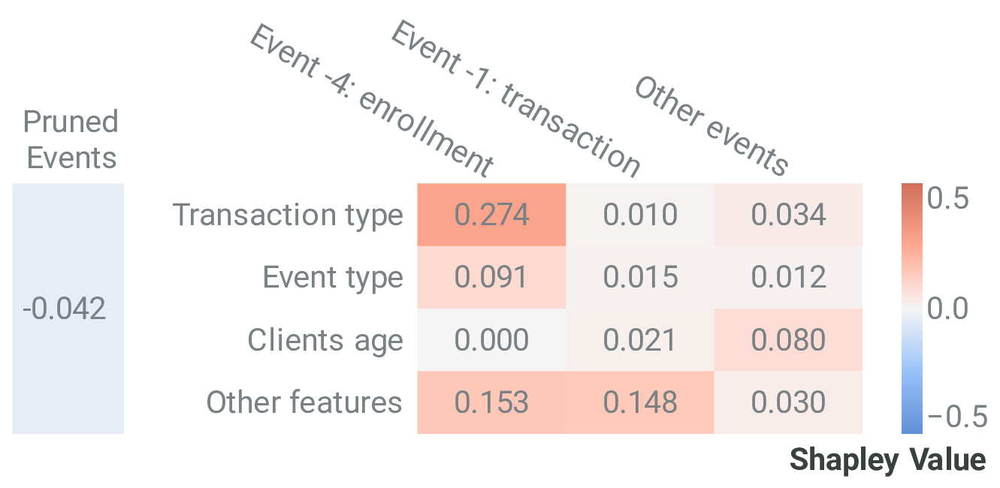
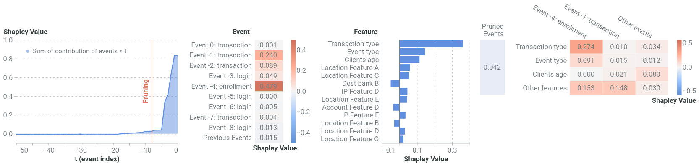
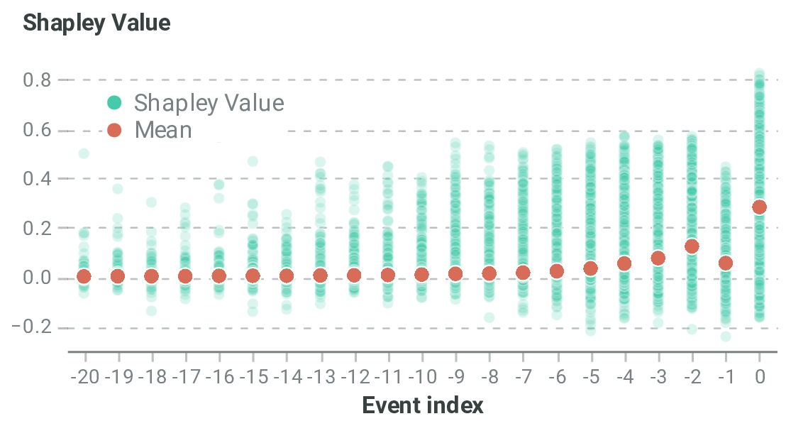
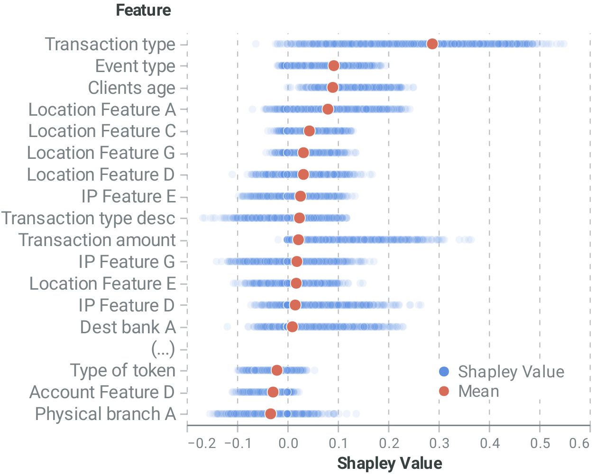
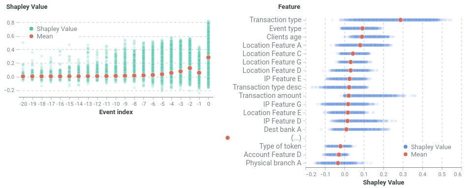

# TimeSHAP
TimeSHAP is a model-agnostic, recurrent explainer that builds upon KernelSHAP and 
extends it to the sequential domain.
TimeSHAP computes event/timestamp- feature-, and cell-level attributions. 
As sequences can be arbitrarily long, TimeSHAP also implements a pruning algorithm
based on Shapley Values, that finds a subset of consecutive, recent events that contribute
the most to the decision.


This repository is the code implementation of the TimeSHAP algorithm 
present in the paper `TimeSHAP: Explaining Recurrent Models through Sequence Perturbations`
published at **KDD 2021**. 

Links to the paper [here](https://arxiv.org/abs/2012.00073), and to the video presentation [here](https://www.youtube.com/watch?v=Q7Q9o7ywXx8).


## Install TimeSHAP
Clone the repository into a local directory using:
```
git clone https://github.com/feedzai/timeshap.git
```

Install the package using pip:

```
pip install timeshap
```

To test your installation, start a Python session in your terminal using

```
python
```

And import TimeSHAP

```
import timeshap
```

## TimeSHAP in 30 seconds

#### Inputs
- Model being explained;
- Instance(s) to explain;
- Background instance.

#### Outputs
- Local pruning output; (explaining a single instance)
- Local event explanations; (explaining a single instance)
- Local feature explanations; (explaining a single instance)
- Global pruning statistics; (explaining multiple instances)
- Global event explanations; (explaining multiple instances)
- Global feature explanations; (explaining multiple instances)

### Model Interface

In order for TimeSHAP to explain a model, an entry point must be provided.
This `Callable` entry point must receive a 3-D numpy array, `(#sequences; #sequence length; #features)`
and return a 2-D numpy array `(#sequences; 1)` with the corresponding score of each sequence. 
In addition, to make TimeSHAP more optimized, it is possible to return the hidden state
of the model together with the score (if applicable), although this is optional.

TimeSHAP is able to explain any black-box model as long as it complies with the 
previously described interface, including both PyTorch and TensorFlow models, 
both examplified in our tutorials ([PyTorch](notebooks/AReM/AReM.ipynb), [TensorFlow](notebooks/AReM/AReM_TF.ipynb)).

Example provided in our tutorials:
- **TensorFLow**
```
model = tf.keras.models.Model(inputs=inputs, outputs=ff2)
f = lambda x: model.predict(x)
```

- **Pytorch** - (Example where model receives and returns hidden states)
```
model_wrapped = TorchModelWrapper(model)
f_hs = lambda x, y=None: model_wrapped.predict_last_hs(x, y)
```


###### Model Wrappers
In order to facilitate the interface between models and TimeSHAP, 
TimeSHAP implements `ModelWrappers`. These wrappers, used on the PyTorch
[tutorial](notebooks/AReM/AReM.ipynb) notebook, allow for greater flexibility
of explained models as they allow:
- **Batching logic**: useful when using very large inputs or NSamples, which cannot fit
on GPU memory, and therefore batching mechanisms are required;
- **Input format/type**: useful when your model does not work with numpy arrays. This
is the case of our provided PyToch example; 


### TimeSHAP Explanation Methods
TimeSHAP offers several methods to use depending on the desired explanations.
Local methods provide detailed view of a model decision corresponding
to a specific sequence being explained.
Global methods aggregate local explanations of a given dataset
to present a global view of the model.

#### Local Explanations
##### Pruning

[`local_pruning()`](src/timeshap/explainer/pruning.py) performs the pruning
algorithm on a given sequence with a given user defined tolerance and returns 
the pruning index along the information for plotting.

[`plot_temp_coalition_pruning()`](src/timeshap/plot/pruning.py) plots the pruning 
algorithm information calculated by `local_pruning()`.



##### Event level explanations

[`local_event()`](src/timeshap/explainer/event_level.py) calculates event level explanations
of a given sequence with the user-given parameteres and returns the respective 
event-level explanations.

[`plot_event_heatmap()`](src/timeshap/plot/event_level.py) plots the event-level explanations
calculated by `local_event()`.



##### Feature level explanations

[`local_feat()`](src/timeshap/explainer/feature_level.py) calculates feature level explanations
of a given sequence with the user-given parameteres and returns the respective 
feature-level explanations.

[`plot_feat_barplot()`](src/timeshap/plot/feature_level.py) plots the feature-level explanations
calculated by `local_feat()`.



##### Cell level explanations

[`local_cell_level()`](src/timeshap/explainer/cell_level.py) calculates cell level explanations
of a given sequence with the respective event- and feature-level explanations
and user-given parameteres, returing the respective cell-level explanations.

[`plot_cell_level()`](src/timeshap/plot/cell_level.py) plots the feature-level explanations
calculated by  `local_cell_level()`.



##### Local Report

[`local_report()`](src/timeshap/explainer/local_methods.py) calculates TimeSHAP 
local explanations for a given sequence and plots them.



#### Global Explanations


##### Global pruning statistics

[`prune_all()`](src/timeshap/explainer/pruning.py) performs the pruning
algorithm on multiple given sequences.

[`pruning_statistics()`](src/timeshap/plot/pruning.py) calculates the pruning
statistics for several user-given pruning tolerances using the pruning
data calculated by `prune_all()`, returning a `pandas.DataFrame` with the statistics.


##### Global event level explanations

[`event_explain_all()`](src/timeshap/explainer/event_level.py) calculates TimeSHAP 
event level explanations for multiple instances given user defined parameters.

[`plot_global_event()`](src/timeshap/plot/event_level.py) plots the global event-level explanations
calculated by `event_explain_all()`.



##### Global feature level explanations

[`feat_explain_all()`](src/timeshap/explainer/feature_level.py) calculates TimeSHAP 
feature level explanations for multiple instances given user defined parameters.

[`plot_global_feat()`](src/timeshap/plot/feature_level.py) plots the global feature-level 
explanations calculated by `feat_explain_all()`.




##### Global report
[`global_report()`](src/timeshap/explainer/global_methods.py) calculates TimeSHAP 
explanations for multiple instances, aggregating the explanations on two plots
and returning them.




## Tutorial
In order to demonstrate TimeSHAP interfaces and methods, you can consult
[AReM.ipynb](notebooks/AReM/AReM.ipynb). 
In this tutorial we get an open-source dataset, process it, train 
Pytorch recurrent model with it and use TimeSHAP to explain it, showcasing all 
previously described methods.

Additionally, we also train a TensorFlow model on the same dataset 
[AReM_TF.ipynb](notebooks/AReM/AReM_TF.ipynb).

## Repository Structure

- [`notebooks`](notebooks) - tutorial notebooks demonstrating the package;
- [`src/timeshap`](src/timeshap) - the package source code;
  - [`src/timeshap/explainer`](src/timeshap/explainer) - TimeSHAP methods to produce the explanations
  - [`src/timeshap/explainer/kernel`](src/timeshap/explainer/kernel) - TimeSHAPKernel
  - [`src/timeshap/plot`](src/timeshap/plot) - TimeSHAP methods to produce explanation plots
  - [`src/timeshap/utils`](src/timeshap/utils) - util methods for TimeSHAP execution
  - [`src/timeshap/wrappers`](src/timeshap/wrappers) - Wrapper classes for models in order to ease TimeSHAP explanations

## Citing TimeSHAP
```
@inproceedings{bento2021timeshap,
    author = {Bento, Jo\~{a}o and Saleiro, Pedro and Cruz, Andr\'{e} F. and Figueiredo, M\'{a}rio A.T. and Bizarro, Pedro},
    title = {TimeSHAP: Explaining Recurrent Models through Sequence Perturbations},
    year = {2021},
    isbn = {9781450383325},
    publisher = {Association for Computing Machinery},
    address = {New York, NY, USA},
    url = {https://doi.org/10.1145/3447548.3467166},
    doi = {10.1145/3447548.3467166},
    booktitle = {Proceedings of the 27th ACM SIGKDD Conference on Knowledge Discovery & Data Mining},
    pages = {2565–2573},
    numpages = {9},
    keywords = {SHAP, Shapley values, TimeSHAP, XAI, RNN, explainability},
    location = {Virtual Event, Singapore},
    series = {KDD '21}
}
```
